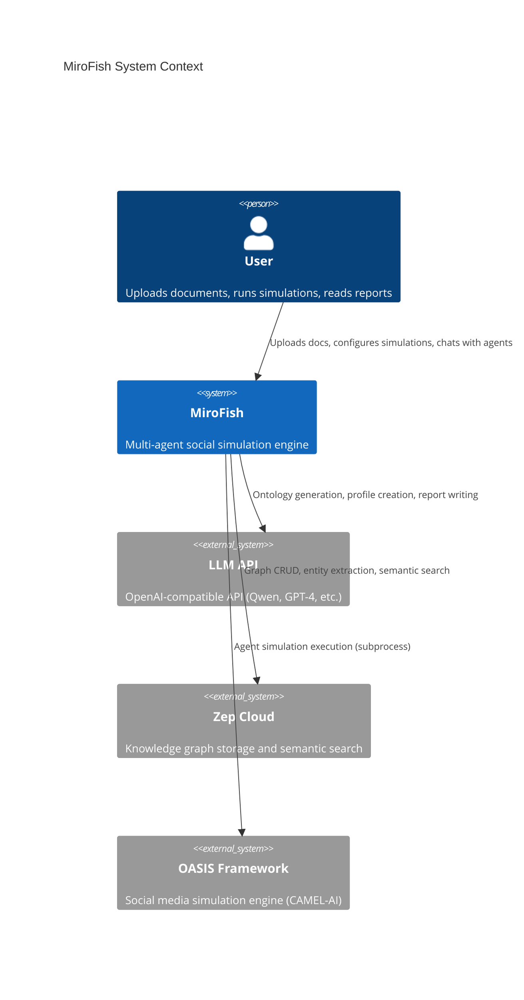
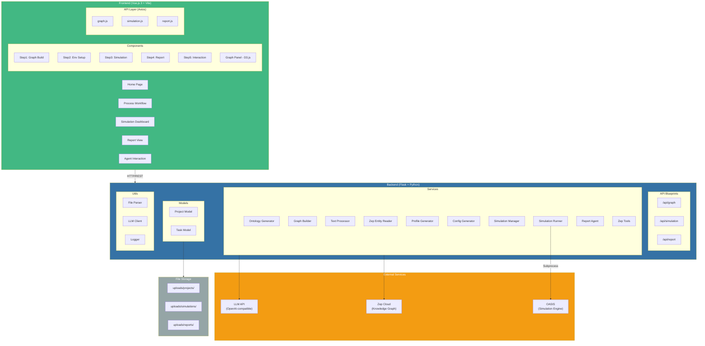

# MiroFish Architecture Overview

MiroFish is a multi-agent social simulation engine that transforms documents into predictive digital worlds. It combines knowledge graphs, LLM-powered agents, and the OASIS simulation framework to model social media discourse.

## System Architecture (C4 - Context)



## High-Level Architecture



## Technology Stack

| Layer | Technology | Version |
|-------|-----------|---------|
| **Frontend** | Vue.js 3 | ^3.5.24 |
| | Vue Router | ^4.6.3 |
| | Axios | ^1.13.2 |
| | D3.js | ^7.9.0 |
| | Vite | ^7.2.4 |
| **Backend** | Flask | >=3.0.0 |
| | Flask-CORS | >=6.0.0 |
| | OpenAI SDK | >=1.0.0 |
| | Zep Cloud SDK | ==3.13.0 |
| | CAMEL-OASIS | ==0.2.5 |
| | PyMuPDF | >=1.24.0 |
| | Pydantic | >=2.0.0 |
| **Runtime** | Python | >=3.11, <=3.12 |
| | Node.js | >=18 |
| **Infra** | Docker | Multi-stage |
| | uv | 0.9.26 |

## Directory Structure

```
MiroFish/
├── frontend/
│   ├── src/
│   │   ├── api/              # Axios API clients
│   │   ├── components/       # Step1-5 + GraphPanel + HistoryDatabase
│   │   ├── router/           # Vue Router config
│   │   ├── store/            # Pending upload state
│   │   └── views/            # Page components (Home, Process, etc.)
│   ├── package.json
│   └── vite.config.js
├── backend/
│   ├── app/
│   │   ├── api/              # Flask blueprints (graph, simulation, report)
│   │   ├── models/           # Project, Task data models
│   │   ├── services/         # Business logic (12 service modules)
│   │   ├── utils/            # File parser, LLM client, logger, retry
│   │   ├── __init__.py       # App factory
│   │   └── config.py         # Config from .env
│   ├── scripts/              # OASIS simulation runner scripts
│   ├── uploads/              # Persistent file storage
│   ├── run.py                # Entry point
│   └── pyproject.toml        # Python dependencies
├── docs/                     # Architecture documentation
├── Dockerfile
├── docker-compose.yml
└── .env.example
```

## Key Design Patterns

- **App Factory**: Flask app creation deferred via `create_app()` for testability
- **Service Layer**: Business logic separated from API handlers
- **Task-Based Async**: Long operations tracked via Task objects with progress callbacks
- **Server-Side State**: Project/simulation state persisted on disk, not in API payloads
- **IPC for Subprocesses**: File-based event log for simulation runner communication
- **Ontology-Driven**: Graph schema defined dynamically by LLM-generated ontology
- **Tool-Calling Agent**: Report Agent autonomously invokes tools (graph search) to answer questions
- **Streaming Sections**: Report sections saved incrementally for progressive frontend rendering
