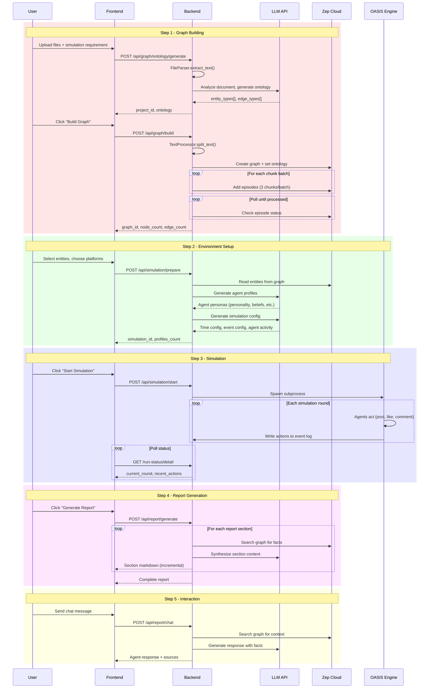
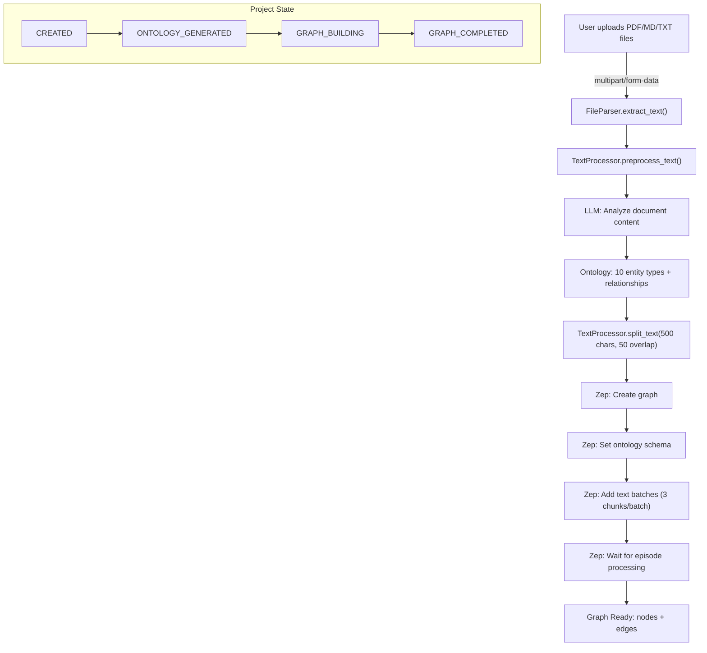
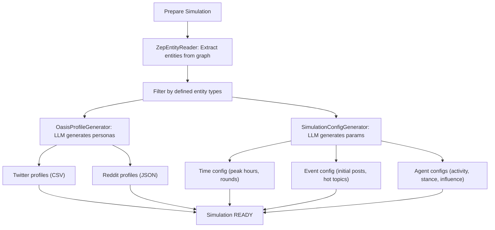
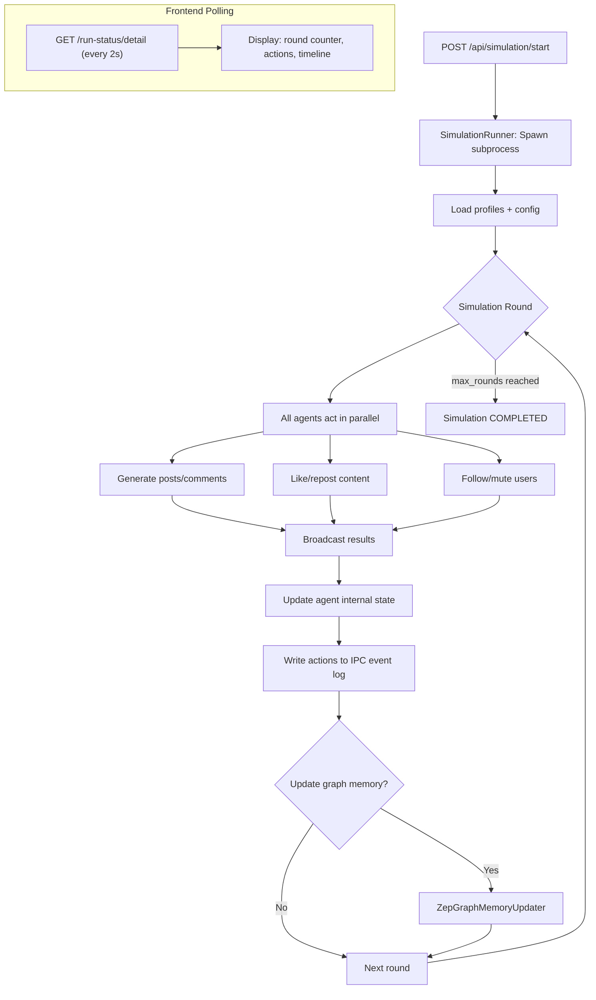
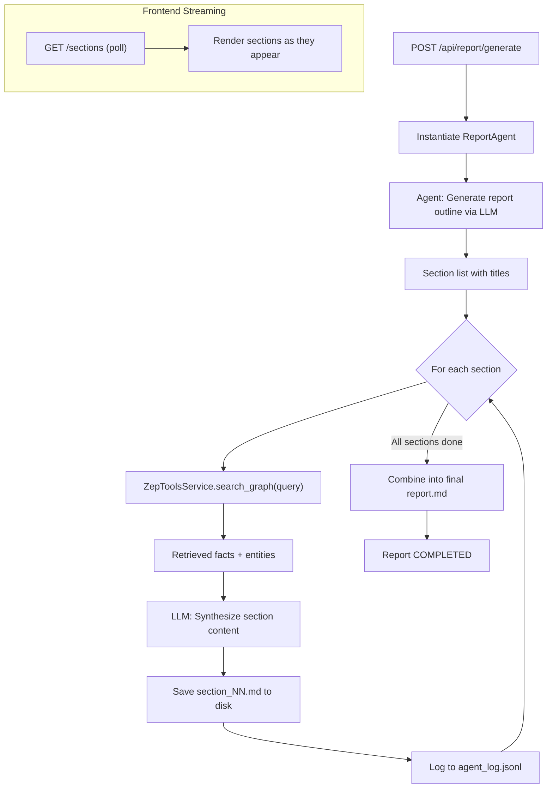
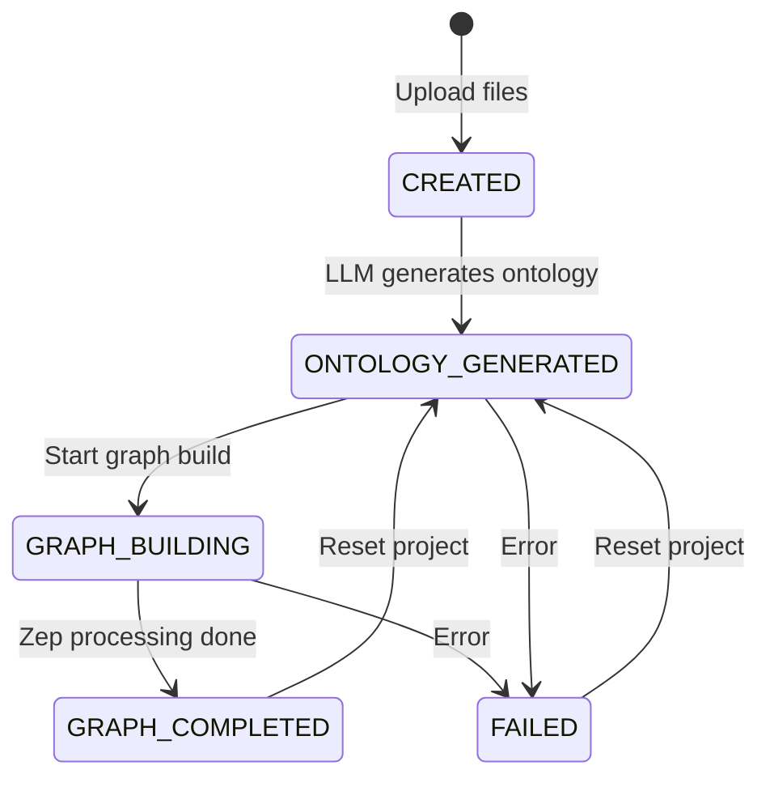
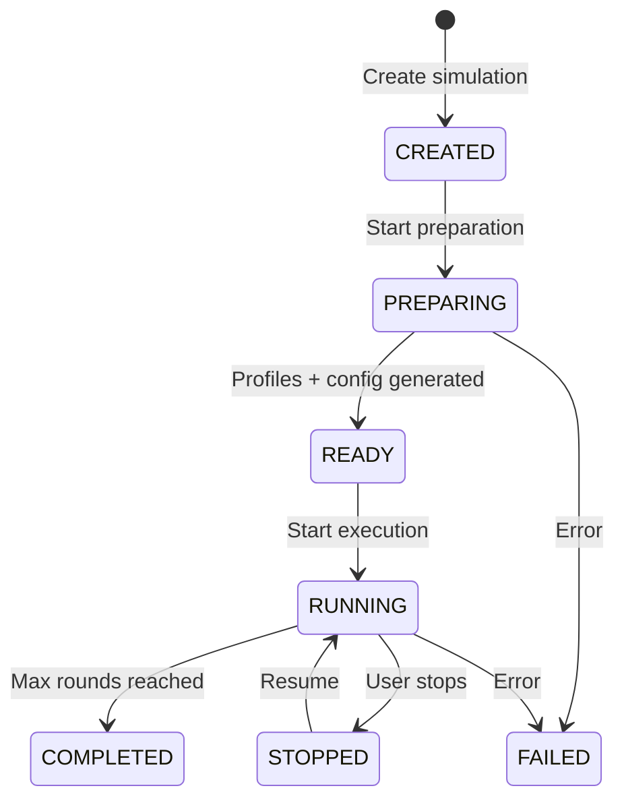
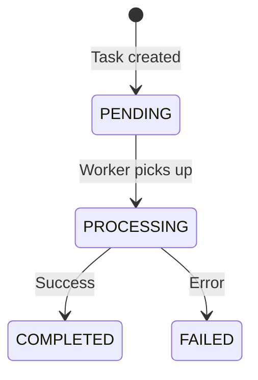

# MiroFish Data Flow

## End-to-End Pipeline

```mermaid
graph LR
    A[Document Upload] --> B[Text Extraction]
    B --> C[Ontology Generation]
    C --> D[Graph Building]
    D --> E[Entity Extraction]
    E --> F[Profile Generation]
    F --> G[Config Generation]
    G --> H[Simulation Execution]
    H --> I[Report Generation]
    I --> J[Agent Interaction]

    style A fill:#e74c3c,color:#fff
    style D fill:#3498db,color:#fff
    style H fill:#2ecc71,color:#fff
    style I fill:#9b59b6,color:#fff
```



## 5-Step User Workflow



## Detailed Data Flow by Step

### Step 1: Document Upload & Graph Building



### Step 2: Simulation Preparation



### Step 3: Simulation Execution



### Step 4: Report Generation



## State Machine Diagrams

### Project Lifecycle



### Simulation Lifecycle



### Task Lifecycle



## File Storage Layout

```
uploads/
├── projects/
│   └── proj_{uuid}/
│       ├── project.json           # Project metadata + ontology
│       ├── extracted_text.txt     # Full document text
│       └── files/
│           └── {uuid}.{ext}      # Uploaded files (safe filenames)
│
├── simulations/
│   └── sim_{uuid}/
│       ├── state.json            # Simulation state
│       ├── simulation_config.json # Generated config
│       ├── twitter_profiles.csv  # Twitter agent profiles
│       ├── reddit_profiles.json  # Reddit agent profiles
│       ├── twitter_simulation.db # SQLite (simulation data)
│       └── reddit_simulation.db  # SQLite (simulation data)
│
└── reports/
    └── report_{uuid}/
        ├── report.json           # Report metadata
        ├── report.md             # Final combined report
        ├── section_01.md         # Individual sections
        ├── section_02.md
        ├── agent_log.jsonl       # Agent tool calls + responses
        ├── console_log.txt       # Console output
        └── progress.json         # Generation progress
```
