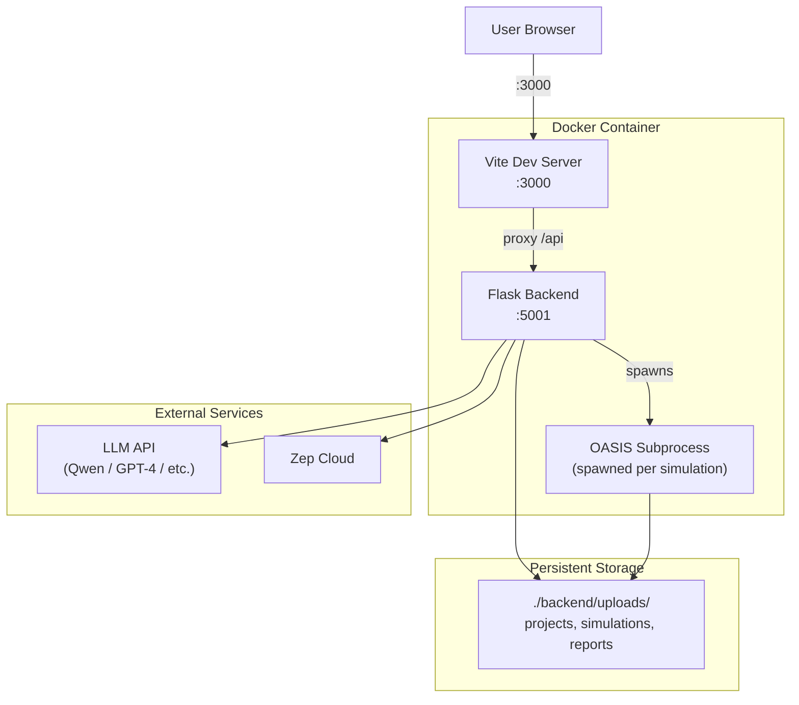
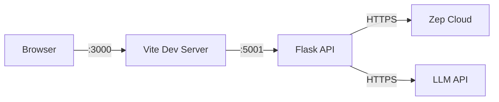
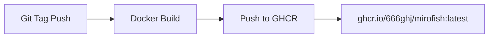

# MiroFish Deployment Guide

## Architecture Diagram



## Prerequisites

| Tool | Version | Check |
|------|---------|-------|
| Node.js | >= 18 | `node -v` |
| Python | >= 3.11, <= 3.12 | `python --version` |
| uv | Latest | `uv --version` |

## Environment Variables

Create `.env` from the template:

```bash
cp .env.example .env
```

**Required:**

| Variable | Description | Example |
|----------|-------------|---------|
| `LLM_API_KEY` | API key for LLM provider | `sk-...` |
| `LLM_BASE_URL` | LLM endpoint URL | `https://dashscope.aliyuncs.com/compatible-mode/v1` |
| `LLM_MODEL_NAME` | Model identifier | `qwen-plus` |
| `ZEP_API_KEY` | Zep Cloud API key | `z_...` |

**Optional:**

| Variable | Default | Description |
|----------|---------|-------------|
| `SECRET_KEY` | `mirofish-secret-key` | Flask secret key |
| `FLASK_DEBUG` | `True` | Debug mode |
| `OASIS_DEFAULT_MAX_ROUNDS` | `10` | Default simulation rounds |
| `REPORT_AGENT_MAX_TOOL_CALLS` | `5` | Max tool calls per report section |
| `REPORT_AGENT_TEMPERATURE` | `0.5` | Report LLM temperature |

## Option 1: Source Code (Recommended)

```bash
# 1. Install all dependencies
npm run setup:all

# 2. Start both frontend and backend
npm run dev
```

**Individual commands:**

```bash
npm run setup           # Node deps (root + frontend)
npm run setup:backend   # Python deps (creates venv)
npm run frontend        # Start frontend only (:3000)
npm run backend         # Start backend only (:5001)
```

**Service URLs:**
- Frontend: http://localhost:3000
- Backend API: http://localhost:5001
- Health: http://localhost:5001/health

## Option 2: Docker

```bash
# Pull and start
docker compose up -d

# Or build locally
docker compose up -d --build
```

**docker-compose.yml** maps:
- Port 3000 (frontend)
- Port 5001 (backend)
- Volume `./backend/uploads` for persistent data

## Port Configuration



## Logging

Logs are written to `backend/logs/` with daily rotation:

```
backend/logs/
├── 2025-12-10.log     # Detailed debug log
├── 2025-12-11.log
└── ...
```

**Log levels:**
- File: DEBUG (all details)
- Console: INFO and above

**Logger hierarchy:**
```
mirofish              # Root logger
├── mirofish.request  # HTTP request/response
├── mirofish.api      # API route handlers
├── mirofish.build    # Graph building
├── mirofish.simulation # Simulation execution
└── mirofish.report   # Report generation
```

## CI/CD

GitHub Actions workflow (`.github/workflows/docker-image.yml`):



Triggered on tag pushes. Builds multi-platform Docker image and pushes to GitHub Container Registry.
