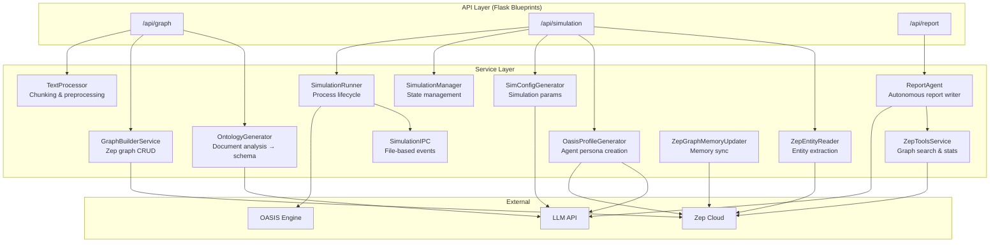
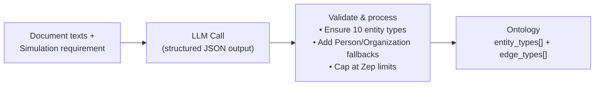
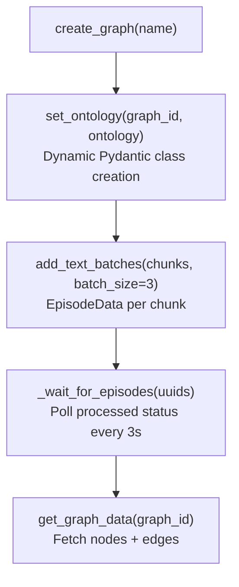
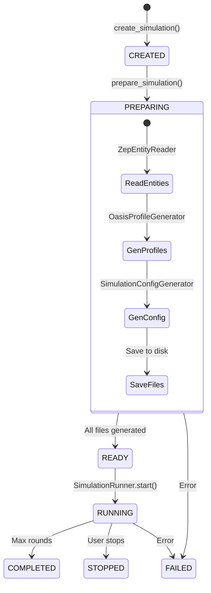
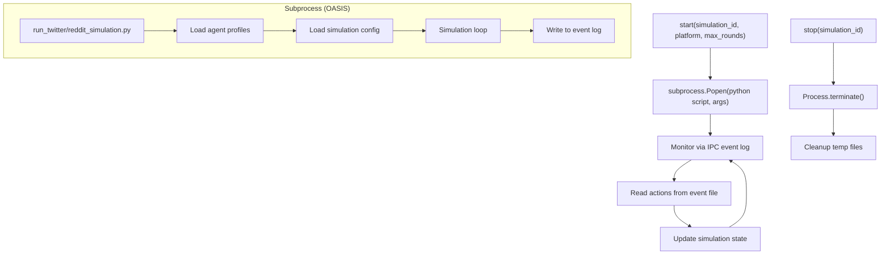
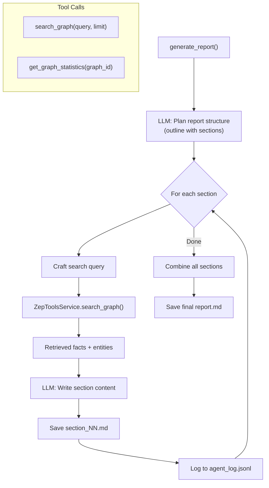
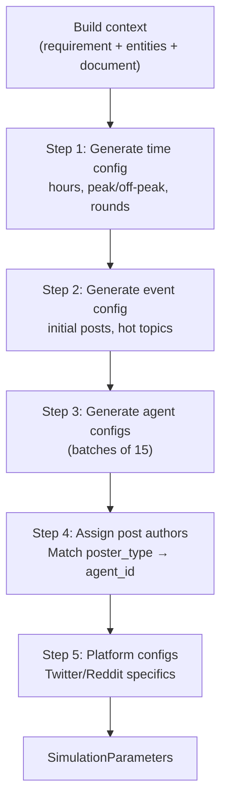
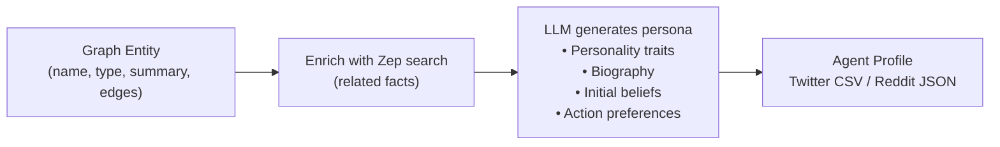
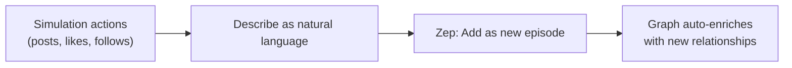
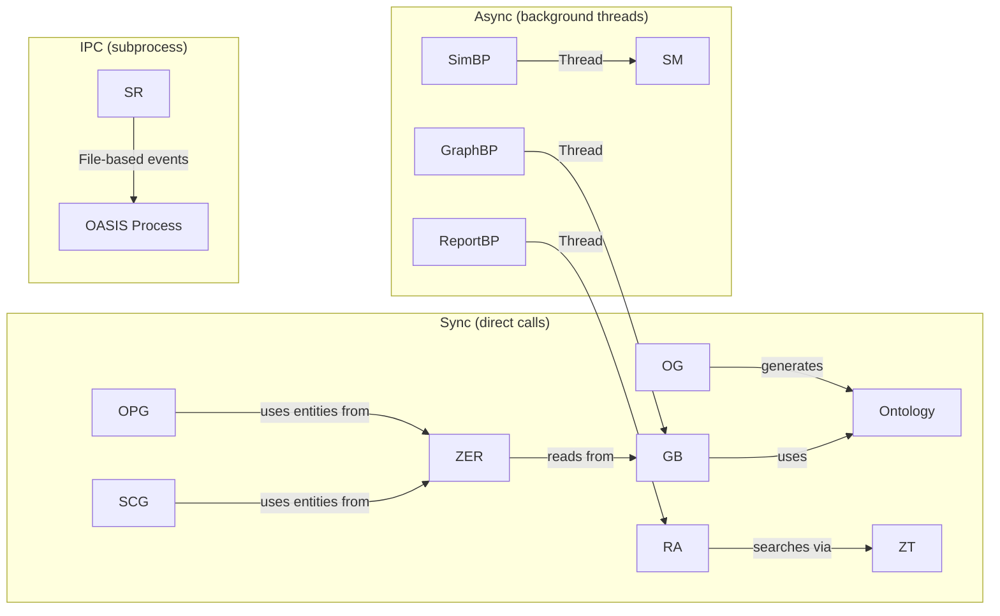

# MiroFish Service Architecture

## Service Layer Overview

## Service Descriptions

### OntologyGenerator

Analyzes document content and generates a schema of entity types and relationships for the knowledge graph.

**Key constraints:**
- Exactly 10 entity types (8 specific + 2 fallback: Person, Organization)
- Max 10 edge types (Zep API limit)
- Entity types must be real-world actors (not abstract concepts)
- Reserved attribute names: `name`, `uuid`, `group_id`, `created_at`, `summary`

### GraphBuilderService

Interfaces with Zep Cloud API to create, populate, and query knowledge graphs.

**Episode processing:** After adding text chunks as episodes, Zep asynchronously extracts entities and relationships. The service polls every 3 seconds with a 600-second timeout.

### SimulationManager

Manages the full simulation lifecycle from creation through completion.

### SimulationRunner

Spawns and manages OASIS simulation as a subprocess.

**Cleanup:** `SimulationRunner.register_cleanup()` ensures all simulation processes are terminated on server shutdown via `atexit`.

### ReportAgent

Autonomous agent that generates analysis reports by iteratively searching the knowledge graph.

**Chat mode:** The same agent supports conversational interaction via `chat(message, history)`, autonomously calling tools to answer user questions.

### SimulationConfigGenerator

Uses LLM to generate optimal simulation parameters in a multi-step process.

**Batching strategy:** Agent configs are generated in batches of 15 to avoid LLM context limits and JSON truncation.

### OasisProfileGenerator

Creates realistic social media agent personas from graph entities.

**Platform formats:**
- **Twitter:** CSV with columns for handle, bio, personality
- **Reddit:** JSON array with full profile objects

### ZepToolsService

Wrapper around Zep Cloud API for graph queries.

| Method | Description |
|--------|-------------|
| `search_graph(graph_id, query, limit)` | Semantic search for facts/entities |
| `get_graph_statistics(graph_id)` | Node/edge counts, entity types |

### ZepGraphMemoryUpdater

Syncs simulation outcomes back to the knowledge graph.

## Inter-Service Communication

## Error Handling

All services follow a consistent pattern:

1. **API Layer:** Returns `{success: false, error: "...", traceback: "..."}` with appropriate HTTP status
2. **Service Layer:** Raises exceptions, caught by API handlers
3. **Background Tasks:** Update Task status to FAILED with error message
4. **Subprocesses:** Errors captured via IPC event log
5. **LLM Calls:** 3-attempt retry with decreasing temperature, JSON repair on truncation
